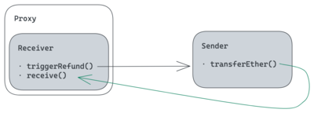

## PoC: receiving ether behind a proxy

### Abstract

This PoC repo represents how contracts behind the transparent proxy pattern can receive ether send with a limited gas stipend.

### The problem

The common ways to send ether from a smart contract are using `address.transfer()` and `address.send()` methods. However, these methods provide a hard capped gas stipend of 2300 gas units (see comparison on [StackExchange](https://ethereum.stackexchange.com/a/38642)): this amount is picked as the minimum necessary amount of gas required to send ether to an EOA (externally owned account, or an arbitrary account) or a smart contract with the magic `receive()` method. Such approach was picked to implicitly prevent an ignoramus sender smart contract from the reentrancy attack (the kind of attack used in The DAO [hack](https://blog.chain.link/reentrancy-attacks-and-the-dao-hack/)), but it also prevented receiving smart contracts from being able to execute anything upon receive, including **being able to reside behind the transparent proxy**. The last statement is the case because of how the transparent proxy works: whenever a call to a smart contract is triggered, the proxy smart contract intercepts it, then reads the address of an implementation smart contract from its storage slot (1), then executes (2) the intercepted call against this implementation smart contract source code.

The reading of a storage variable using `SLOAD` (1) consumes up to 2100 gas units ([link](https://github.com/wolflo/evm-opcodes/blob/main/gas.md#a6-sload)), and executing the call using the `DELEGATECALL` (2) potentially consumes more than 2600 gas units ([link](https://github.com/wolflo/evm-opcodes/blob/main/gas.md#aa-3-delegatecall)), which in sum gives more than gas stipend of 2300 available during the call.

Still, there are valid scenarios were the call can succeed. This document tests different scenarios were a smart contract behind the transparent proxy can still receive ether on its `receive()` method.

### Summary

Side note: here and below, the *receiver* is a smart contract behind the transparent proxy.

- ❌ ether can't be transferred to a cold *receiver* (cold means it hasn't been called before within the transaction)
- ✅ ether can be transferred back to a *receiver* with empty `receive` method (no additional logic inside)
- ❌ ether can't be transferred back to a *receiver* with non-empty `receive` method

The second scenario succeeds because repeated reads of the same storage variable (`SLOAD`ing the implementation address) costs only 100 gas units instead of 2300. So, if the *receiver* makes a call to a contract which sends ether back, this call and the subsequent transfer of ether back to the *receiver* succeeds.



### Test results

```
hh test


  Various way to send ether to a transparent proxy
    ✔ Should refund back to simple account (sanity test) (650ms)
    ✔ Should forward to simple account (sanity test) (38ms)
    ✔ Should NOT forward to Simple Invoker (implementation slot NOT cached) (51ms)
    ✔ Should refund back to Simple Invoker (implementation slot IS cached) (70ms)
    ✔ Should NOT refund back to Protected Invoker (additional slot read) (39ms)


  5 passing (850ms)
```